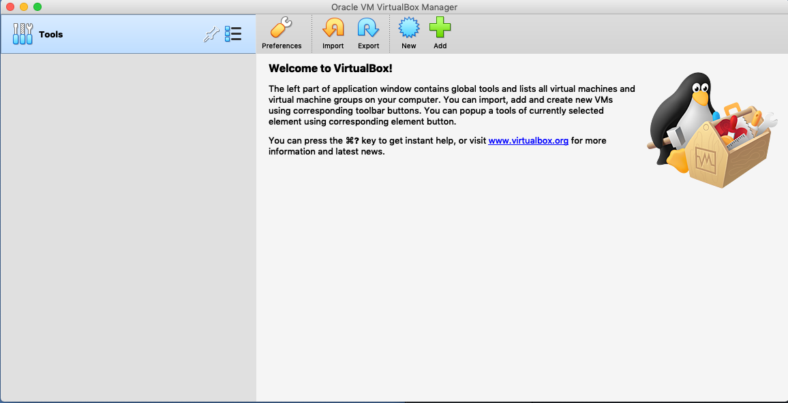
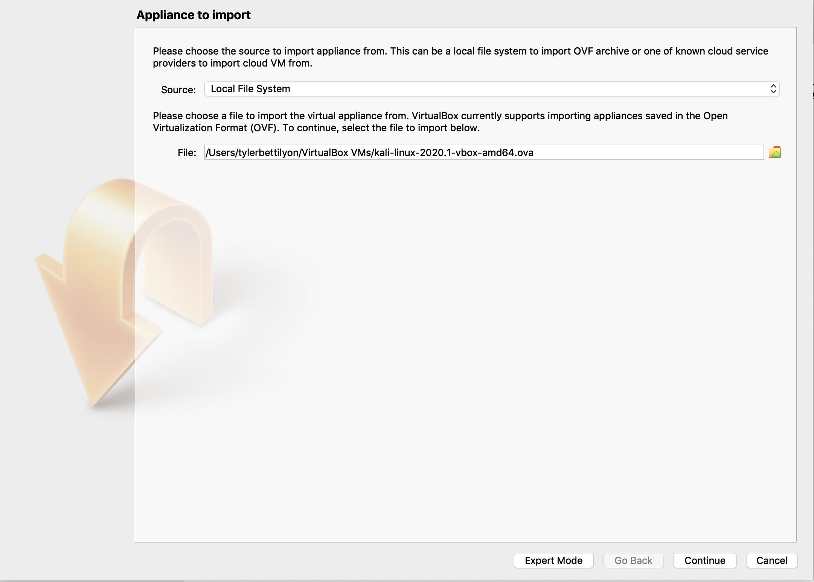
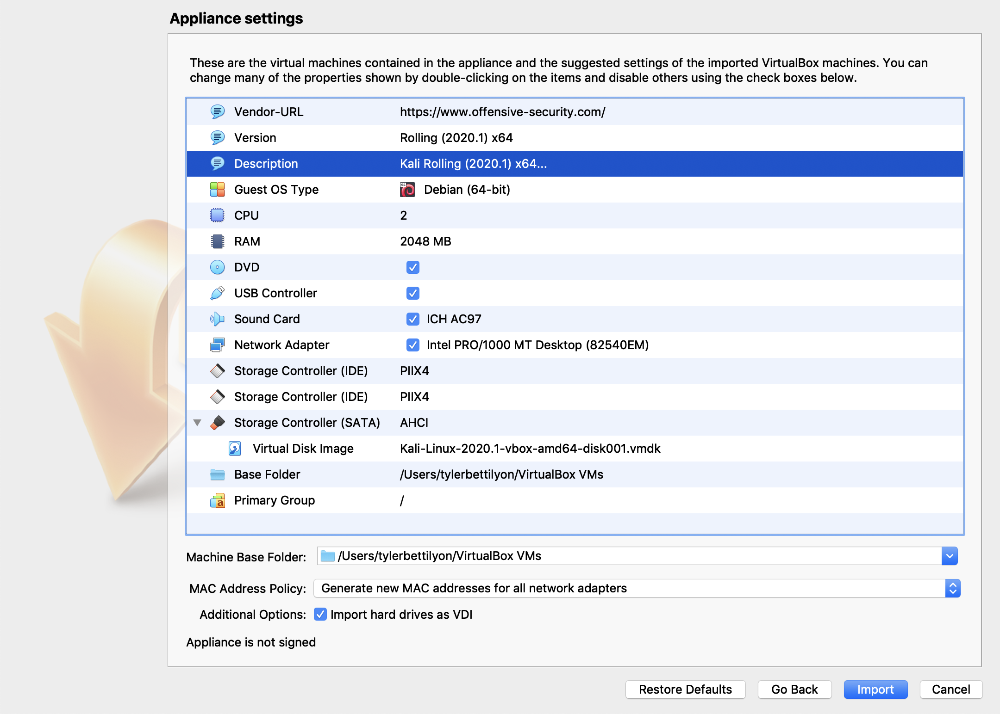
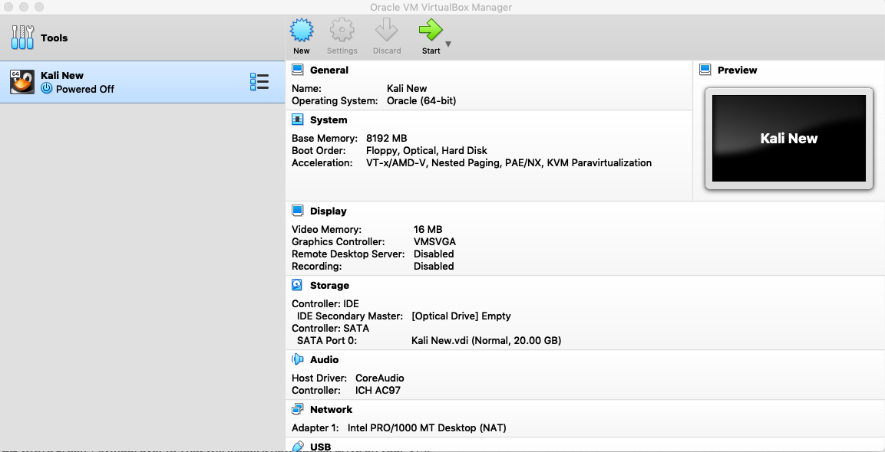
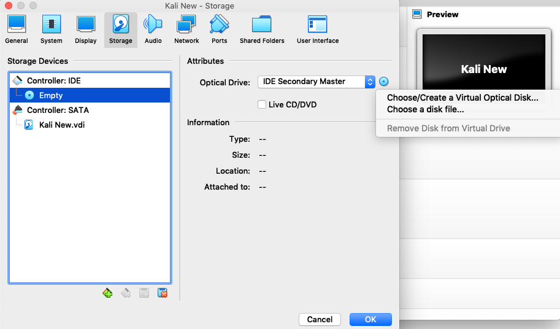

# Setup and Tools

Like any trade, penetration testers use a variety of tools to do their job. The list of such tools is extensive. Some are niche and apply only to specific circumstances, attack types, or targets. Others are broadly used in the industry and offer a more comprehensive suite of functionality. The lessons in this repository revolve around the use of two such broadly used tools: Kali Linux and Burp Suite.

Prior to class, or at the very start, students will need to install a virtual machine host software (we suggest VirtualBox, but others are also freely available), and a Kali Linux virtual machine (to be run by the VM host). Kali ships with a host of useful penetration testing tools some of which will be used in the lessons. The most important such program is called Burp Suite, which also requires a bit of setup to use. Additionally, the exercises in this repository rely on publicly available CTF's hosted by the Hacker One — a bug bounty platform.

This section is a walkthrough for installing VirtualBox and Kali; configuring Brup; and signing up for a HackerOne account in order to access the CTFs.

Ideally, students should do this prior to class as downloading and installing Kali takes awhile.

## Download and Install VirtualBox

Go to the [VirtualBox downloads page](https://www.virtualbox.org/wiki/Downloads) and download the appropriate platform package for your system. These are installers, so it should be relatively straight forward. More detailed information about installing VirtualBox and any extension packs (which are not required but may be helpful in some cases) can be found in the [online user manual](https://www.virtualbox.org/manual/UserManual.html#intro-installing).

Follow the installation instructions then open the VirtualBox application, it will look something like this:

## Why Kali and a VM?

Kali is a Linux distribution maintained by Offensive Security. It is largely based on Ubuntu, but comes with numerous security tools already installed. It is worth noting that Offensive Security does not recommend that you use Kali as your primary operating system. Instead they suggest running Kali through a virtual machine or as a secondary OS that you only use while actively engaged in pen-testing.

There are lots of good reasons to use a VM while engaged in security work. Here are two:

1. The work sometimes involves using dangerous tools, intentionally running viruses, and doing things as root — messing up your virtual machine is a lot less costly than messing up your main computer.
1. Being a hacker sometimes makes you a target for hackers — using a VM adds a layer of indirection between your computer someone who may want to hack you!
1. It allows you to easily run different operating systems, which has a variety of advantages from testing OS specific vulnerabilities, to gaining advantages (such as a wealth of pre-installed tools).

Do note: a VM is not a panacea. Some exploits do exist that can escape the VM and infect your host machine. You still need to exercise caution and judgement. It is also worth noting that Kali is not the only distribution focused on pen-testing, and you might prefer an alternative such as Parrot Security OS or BlackArch.

We had to pick one and Kali is relatively popular.

## Download a Kali Image

Kali images are also available on [Offensive Security's website](https://www.offensive-security.com/kali-linux-vm-vmware-virtualbox-image-download/#1572305786534-030ce714-cc3b). These are specific to different virtualization programs, including VirtualBox. If you go this route, choose the appropriate system. Getting started this way will be easier, and take less time. You'll have less control over your system, and some people may encounter odd configuration issues depending on their host environment setup. **If you just want to get started now, choose this option. You can always easily install a new VM later.**

Download the latest release from [Kali's website](https://www.kali.org/downloads/). You should download the "installer" image, rather than the "live" or "NetInstaller" images. These are .iso files, and installing them into your VM will be a bit more involved, and will take longer. You'll have more control over your system with this installation, and when you're done the configuration is sure to work. **If you're familiar with setting up linux systems and VirtualBox already, and want more control choose this option.**

## Add Kali to VirtualBox (Easier .ova Method)

* When it doubt, stick with the defaults.
* Open VirtualBox.
* Navigate to file -> import application.
* In the source drop down select "Local File System"
* For the file, choose the .ova you downloaded.

* You can look over the settings, and choose to generate new MAC addresses if you want.

* Click import, you'll be asked to accept a license agreement.
* Now you'll have to wait a bit.
* Back on the main screen you can change any settings you want to before booting.
  * The default RAM size is only 2 GB, I would allocate more. (settings -> system -> base memory)
* **Note that when you log in the username/password will be kali/kali.**
  * You may wish to change this.

## Add Kali to VirtualBox (.iso Method)

Once your Kali image is downloaded, you'll have to install a Kali virtual machine. Open VirtualBox and click "new" then,

* Give your VM a name, I cleverly chose "Kali New"
* Allocate a reasonable amount of memory, I have 16 GB RAM on my host and allocated 8 GB to my VM
  * (You can change this later)
* Select the "create a virtual hard disk now" option then click create.
  * Select the VDI option, and dynamically allocated size option.
  * I allocated an initial 20 GB of hard drive space
* Now click create.

You should now see something like this:

Before you boot your new VM, you'll need to specify the `.iso` file to install Kali to the VM. To do this:

* Select your new VM and click on settings.
* Navigate to the storage tab.
* Underneath "Controller: IDE" there should be a picture that looks kind of like a CD and the word "Empty" (see image below)
  * Click on "Empty"
  * Now, on the right under "attributes" click on image of a CD next to the "Optical Drive"
  * Select "choose disk file" and select the Kali ISO you downloaded previously.
  * Click OK

Now you should be ready to boot up your Kali system! Click your VM, and then click start. At this point you'll need to work through the installation of Kali. Select the graphical install and work through the prompts. The image may take a few moments to boot up, so be patient (especially if you did not allocate much RAM to your VM).

Some advice:

* When in doubt stick with the defaults.
* Use the whole disk, rather than partition it.
  * It's a virtual disk anyway so partitioning it is just overkill.
* Don't specify an HTTP proxy.
* Select the Kali desktop environment
* Select the "generic metapackages"
  * "... default -- recommended tools"
* Select standard system utilities.
* Install the GRUB bootloader if prompted.
  * to `/dev/sda`

## Configure Burp Proxy

First, open up Firefox inside your Kali VM, then follow the instructions here. Burp acts as a local proxy and provides a host of useful tools for inspecting our web traffic, modifying it, repeating requests with modifications, and much more. In order to use it, we must configure FireFox to proxy traffic through Burp.  [https://support.portswigger.net/customer/portal/articles/1783066-configuring-firefox-to-work-with-burp](https://support.portswigger.net/customer/portal/articles/1783066-configuring-firefox-to-work-with-burp)

Now that the proxy is configured, you need to open Burp and configure it to play nicely with SSL. This involves adding a root SSL certificate to FireFox (which is an example of another good reason to use a VM!). Open Burp in your Kali VM, then click the "proxy" tab. Click the box that says "Intercept is on" and then  follow these instructions: [https://support.portswigger.net/customer/portal/articles/1783087-installing-burp-s-ca-certificate-in-firefox](https://support.portswigger.net/customer/portal/articles/1783087-installing-burp-s-ca-certificate-in-firefox)

## Almost Done: Get a HackerOne Account

Go to [https://www.hackerone.com](https://www.hackerone.com) and signup for a new account, then go to [https://ctf.hacker101.com/ctf](https://ctf.hacker101.com/ctf) to access the CTF exercises.

## Wow, that was a lot!

Getting started is often the hardest part. Now you're ready to learn more about these tools and practice putting them to good use. Head to the next lesson if you're self studying, or wait for your scheduled class to start!
